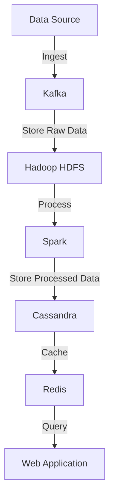

# Big Data Project

This project illustrates an approach of creating an end-to-end pipeline for a big data project for academic purposes.

## I. Introduction

This section provides an overview of the project, its objectives, and the dataset used. The goal is to create a data pipeline that ingests data from a source, processes it, and stores it in different databases for various use cases. For example, you can use a dataset of e-commerce transactions to demonstrate the pipeline.

## II. Global System Architecture

This section describes the overall architecture of the system, including the components and their interactions. The architecture includes data ingestion, storage, processing, and visualization layers.

### Pipeline Diagram

## III. Big Data Solution (Backend) Implementation

This section details the implementation of the backend components of the big data solution, including data ingestion, storage, and processing.

### Data Ingestion with Kafka

- Use Kafka to ingest streaming data (e.g., e-commerce transactions).
- Set up Kafka producers to send data to Kafka topics.
- Set up Kafka consumers to read data from Kafka topics.

### Data Storage with Hadoop

- Use Hadoop HDFS to store raw data ingested from Kafka.
- Set up a Hadoop cluster using the docker-hadoop setup in your workspace.

### Data Processing with Spark

- Use Spark to process the data stored in Hadoop HDFS.
- Perform data cleaning, transformation, and aggregation using Spark.
- Store the processed data back to HDFS or directly to Cassandra.

### Data Storage with Cassandra

- Use Cassandra to store processed data for fast read and write operations.
- Set up a Cassandra cluster using the cassandra-spark-docker setup in your workspace.

### Example Implementation a

#### 1. Set Up Kafka

Create a `docker-compose.yml` file to set up Kafka and Zookeeper.

#### 2. Set Up Hadoop

Use the docker-hadoop setup to create a Hadoop cluster.

Write scripts to move data from Kafka to HDFS.

#### 3. Set Up Spark

Use the cassandra-spark-docker setup to create a Spark cluster.

Write Spark jobs to process data from HDFS and store it back to HDFS or Cassandra.

#### 4. Set Up Cassandra

Use the cassandra-spark-docker setup to create a Cassandra cluster.

Define keyspaces and tables to store processed data.

#### 5. Set Up Redis

Create a `docker-compose.yml` file to set up Redis.

Write scripts to cache data from Cassandra to Redis.

## IV. Visualization (Frontend)

This section describes the implementation of the frontend components for data exploration and visualization.

### Data Exploration and Visualization

- Use a web application (e.g., Next.js) to visualize the data stored in Cassandra and Redis.
- Implement APIs to query data from Cassandra and Redis and display it in the web application.

### Example Implementation b

#### 6. Create a Web Application

Use Next.js to create a web application.

Implement APIs to query data from Cassandra and Redis. Visualize the data using charts and graphs.

## Example Commands and Code

### Kafka Producer (Python)

### Spark Job (Python)

### Redis Cache (Python)

### Web Application (Next.js)

This is a high-level overview and example code snippets to get you started. You can expand on this by adding more features, handling edge cases, and optimizing the pipeline.
